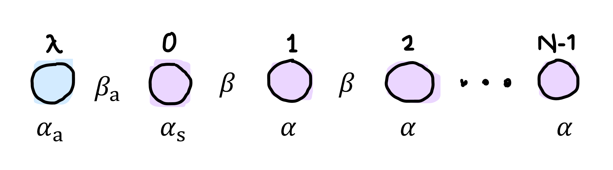

---
kernelspec:
  name: python3
  display_name: 'Python 3'
---

# 1D problem

:::{tip} Key points
* solving a simple chemisorption problem with the molecular orbital approach
* applying the tight-binding approximation
* finding the different kinds of solutions to the 'eigenvalue problem' in terms of different adatom-surface interaction parameters
:::

Each atom has an atomic orbital $\phi_m(\vec{r})$ with $m=\lambda$ for the adsorbate and $m,=0,...,N-1$ the substrate. We can write the total system wavefunction (molecular orbital) $\psi_k$ as an LCAO, where $k$ indicates different energy levels of the molecular orbitals:
$$\psi_k =\sum_m c_{mk} \phi_m$$

Or in bra-ket notation:
$$|k\rangle = \sum_m|m\rangle\langle m|k\rangle$$
where $c_{mk}=\langle m|k \rangle$.

Each molecular orbital satisfies the 1-electron Schrödinger equation
$$H|k\rangle = E_k |k\rangle.$$
By inserting $|k\rangle$ and multiplying by $\langle n|$, we get the Schrödinger equation in terms of matrix elements:
$$\sum_m c_{mk} \langle n|H|m \rangle = E_k \sum_m c_{mk} \langle n|m \rangle.$$

If we assume orthonormal atomic orbitals, $\langle n|m \rangle= \delta_{nm}$. We also write the Hamiltonian in the tight-binding approximation:
$$
H = 
\begin{pmatrix} 
\ddots & \beta &&& \\
\beta & \alpha & \beta && \\
& \beta & \alpha & \beta & \\
&& \beta & \ddots & 
\end{pmatrix}$$

which transforms our Schrödinger equation into

$$
(E_k-\alpha)c_{nk} = \beta (c_{n+1,k} + c_{n-1,k}).$$

This equation has three 'boundary conditions':
* For $n=0$: $(E_k-\alpha_s)c_{0k} = \beta c_{1k}+\beta_a c_{\lambda k}$
* For $n=\lambda$: $(E_k-\alpha_a) c_{\lambda k} = \beta_a c_{0k}$
* For $n=N$: $c_{Nk}=0$

Now we take the Ansatz $c_{n\pm \ell,k}=e^{\pm i\ell\theta_k} c_{nk}$. Actually, this 'plane wave Ansatz' is a common Ansatz for a wave function in periodic systems, and corresponds to Bloch's theorem. The book provides a derivation of this Ansatz from scratch. By inserting this Ansatz, the Schrödinger equation can then be written as 
$$X_k := {E_k-\alpha \over 2\beta}=\cos \theta_k$$
This defines the energy band. Hence, $\beta$ is related to the band width. 

We can also express the LCAO coefficient at any point in terms of the plane waves and the coefficient at $n=0$ (actually not entirely clear to me how using positive and negative waves should be motivated here),
$$c_{nk}= (ae^{in\theta_k} + be^{-in\theta_k})c_{0k}$$
or by re-expressing some parameters in terms of others
$$c_{nk}=A \cos(n\theta_k) + B\sin (n\theta_k)$$

Now we apply the boundary conditions. $c_{Nk}=0$ gives 
$$B=-{A\cos N\theta_k \over \sin N\theta_k}$$
and with the cosine/sine sum rule this yields
$$c_{nk} = A {\sin(N-n)\theta_k \over \sin N \theta_k}$$
which implies that $A=c_{0k}$.

The other two boundary conditions can also be applied. Through some algebra (including some cosine/sine sum rules), one gets an 'eigenvalue equation':
$$(z_a+2\cos\theta_k)\left[z_s + {\sin(N+1)\theta_k \over \sin N\theta_k}\right] = \eta^2$$
where in the derivation process the following parameters were defined:
* the chemisorption parameter $z_a = (\alpha-\alpha_a)/\beta$
* the surface parameter $z_s=(\alpha-\alpha_s)/\beta$
* the chemisorption (adbond) parameter $\eta=\beta_a/\beta$.

Let's consider solutions for $\eta=0$. Then the solutions $\theta_k$ to the eigenvalue problem satisfy either 
$$
-z_a=2\cos\theta_k$$ 
(if $-2\leq z_a\leq 2$), or
$$-z_s = {\sin(N+1)\theta_k \over \sin N \theta_k}.$$
The first equation gives one solution and the second one gives $N$ solutions.

The $N$ solutions are visible in the graph below, where the purple lines are two possible values of $-z_s$ (1 and -1), 

[Play with the graph on Desmos](https://www.desmos.com/calculator/gjrl6mfzzh)

But when $-z_s$ becomes larger than 1 or smaller than -1, a solution disappears -- at least it does on the real number line. We can consider solutions for complex $\theta_k = \xi_k + i\mu_k$, where $\mu_k>0$ (it does not make sense to include $\mu_k=0$, because then we get real solutions; I think the reason to not include negative $\mu_k$ is because it will give duplicate solutions). We can then write $X_k=\cos\xi_k \cosh \mu_k - i\sin \xi_k \sinh \mu_k$. However, the energy must be real, so $\sin\xi_k=0$, which gives $\xi_k=j\pi,j=0,1,2,...$. Consequently $\cos \xi_k$ is either 1 or -1, so $\xi_k=0$ and $\xi_k=\pi$ already describe the complete space of solutions, higher $j$ just gives duplicates. 

So overall we get two possible additional solutions by considering complex $\theta_k$,
$$X_k=\cosh \mu_k \quad\text{or}\quad X_k=-\cosh \mu_k.$$
The positive one lies above the bulk band, and we call them **P-states**. The negative one lies below the bulk band, and we call them **N-states**. 

In conclusion, there are $N+1$ atoms, each with one electron, so there are $N+1$ molecular orbital states, i.e. $N+1$ solutions for $\theta_k$:
* $N-1$ real solutions in the **bulk band**. 
* 1 solution for the adatom
* 1 solution for the surface
The latter two may be real (in bulk band), or complex (P-states and N-states).

We now show that bulk band states are **delocalized** and P/N-states are **localized**. [Find the corresponding graph on Desmos.](https://www.desmos.com/calculator/axg27roxad)

## Bulk band states
$$c_{nk} = A {\sin(N-n)\theta_k \over \sin N \theta_k}$$
Oscillates in $n$ with constant period. So delocalized.

## P-states

Large $N$ and if $\theta_k$ has a positive imaginary part $(\mu_k>0)$:
$$c_{nk}={\sin(N\pm n)\theta_k \over \sin N\theta_k} \to e^{\mp in\theta_k}$$

If $\theta_k=i\mu_k$:
$$c_{nk}=Ae^{-n\mu_k}$$
which is a **decaying** wavefunction.

<!-- The boundary condition for $c_{\lambda k}$ can be rewritten to:

$$c_{\lambda k} = \eta A {1 \over z_a + 2 \cosh \mu_k}$$ -->

Inserting the large-$N$ approximation for the wavefunction in the 'eigenvalue equation', we get
$$(z_a + 2 \cosh \mu_k) (z_s + e^{\mu_k})=\eta^2.$$

By setting $x=e^\mu$ we can solve this equation graphically; we get a function
$$y=(z_a + x + {1 \over x})(x + z_s)$$
and we find the intersections with
$$y=\eta^2.$$

The graphical solution is shown below:

[Find the Desmos graph here.](https://www.desmos.com/calculator/ire0kiwz8k)

So for these particular parameters there are 2 localized P-states. 

## N-states
If $\theta_k=\pi+i\mu_k$:
$$c_{nk}=A(-1)^n e^{-n\mu_k}$$
Decaying but oscillatory wave-function.

By inserting the large-$N$ approximation for the N-state wavefunction in the eigenvalue equation, we get an algebraic equation

$$y=(z_a - x - {1 \over x})(z_s - x)$$
which can be solved as before. 

The $N$-states appear at different parameter values than $P$-states. They can even coexist. Check out [Desmos](https://www.desmos.com/calculator/ire0kiwz8k)!
